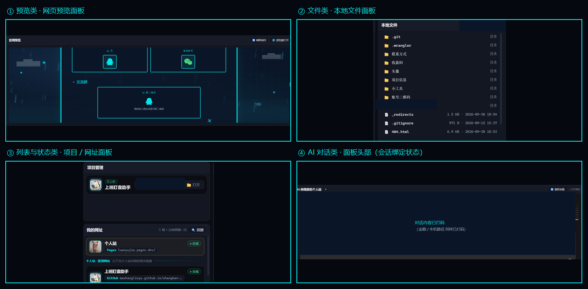

# 01 · 场景模式

> **一个窗口 = 一块场景。** 本板块只讲「壳」：场景怎么定义、面板怎么排、类型怎么注册。
> **不涉及 AI** —— 想换界面只动这里。

> ⚠️ **新手谨慎**：本板块能抄的是**结构与写法**，不是现成配置 —— 面板 `type` 必须是你**已注册**的类型（写错只会显示一行灰字，不报错），坐标、路径、前缀全要按你自己的工程改。先读 [新手必读](../新手必读.md)。

> 四类典型面板（同一间工作台里截的）：**预览类**（网页/文档直接看）、**文件类**（左边目录树、右边列表）、
> **列表与状态类**（项目、网址 —— 带状态点与"探测"）、**AI 对话类**（头部就是它的身份：场景名 + 会话绑定状态）。

---

## 这个板块有什么

| 文件 | 内容 |
|---|---|
| [场景配置格式](场景配置格式.md) | 一个场景配置文件的完整字段说明 + 最小可用示例 + 加载链路 + 症状对照 |
| [面板类型与注册](面板类型与注册.md) | 渲染器表怎么工作、怎么加一个自己的面板类型（含可拷贝代码） |
| [布局与网格](布局与网格.md) | `col / row / w / h` 怎么算、`cols` 什么时候改、六种常见版式 |
| [面板通用能力](面板通用能力.md) | 标题栏、展开到最高、**面板自刷新通道**、与外壳通信、状态小字 |

`模板/` 里有两个**纯壳场景**（[最小示例](../模板/场景-最小示例.json) / [带 AI 面板](../模板/场景-带AI面板.json)）和一个[面板渲染器模板](../模板/面板-HelloWorld.js)，拷走改名就能用。

---

## 核心概念（先记住这几条）

1. **场景 = 一份 JSON 配置 + 一组面板**。
   配置描述「这个场景叫什么、什么主题、由哪几块面板拼成」，不写业务逻辑。

2. **面板 = 一个类型 + 一块位置**。
   配置里只写 `type`（比如 `web`、`file`、`preview`），具体长什么样由**渲染器**决定 ——
   所以加新面板 = 注册一个新渲染器，**不用改场景配置的结构**。

3. **AI 面板是一种特殊面板**，比普通面板多三个字段（`sessionTitle` / `sessionId` / `pinTarget`）。
   这三个字段是板块 02 的全部主题，这里只要知道「它们让 AI 认得场景」就够了。

4. **场景之间完全隔离**：各自的面板、各自的会话、各自的记忆互不干扰。
   加一个场景不该影响已有场景 —— 这是设计底线。

---

## 建议的阅读顺序

1. [场景配置格式](场景配置格式.md) —— 先看懂"一份 json 描述一个场景"；
2. [布局与网格](布局与网格.md) —— 照着版式表把自己的场景排出来；
3. [面板类型与注册](面板类型与注册.md) —— 内置类型不够用时，自己加一个；
4. [面板通用能力](面板通用能力.md) —— 让改动"自己生效"，别让用户去点刷新。

> 只想先跑起来：把 [`模板/场景-最小示例.json`](../模板/场景-最小示例.json) 另存为 `scenarios/demo.json`，切场景即可看到三块面板。

---

⬅️ 回 [总目录](../README.md) ｜ 下一板块 ➡️ [02-会话定位与跟随](../02-会话定位与跟随/)
