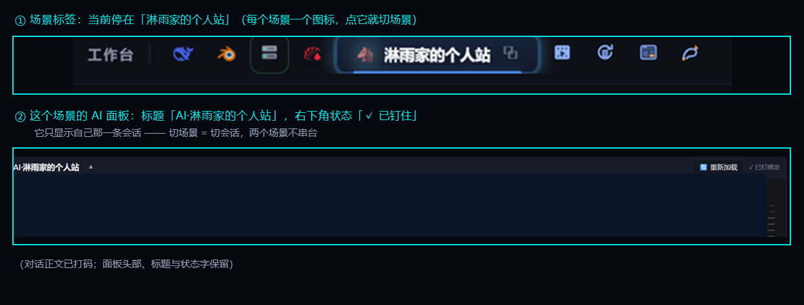

# 02 · 会话定位与跟随

> **工作台和「多标签浏览器」的根本区别就在这个板块。**
> 多个场景共用一个 AI 引擎，AI 怎么知道「我是谁、我在哪个场景、我该干哪份活」？
> 答案分两半：**定位自己**（身份与记忆）+ **跟着窗口**（会话绑定）。

> ⚠️ **新手谨慎**：本板块讲的是**机制**，示例不能照抄 —— 三个绑定字段必须换成**你自己真实存在**的会话名与会话 id，否则面板根本不会钉会话（而且**不报错**，只是显示别的那条）。先读 [新手必读](../新手必读.md)。

> 「跟着窗口走」长什么样：① 顶上每个图标是一个场景，当前停在哪个场景一目了然；② 这个场景的 AI 面板
> 标题就是它的身份（`AI·场景名`），右下角的 **`✓ 已钉住`** 说明它已经认领了自己那一条会话。

---

## 这个板块有什么

| 文件 | 内容 |
|---|---|
| [一 · 身份是怎么认领的](一-身份是怎么认领的.md) | 会话 ID → 场景索引 → 定位卡 → 场景记忆，四步认领 |
| [**二 · 会话绑定三字段**](二-会话绑定三字段.md) | `sessionTitle` / `sessionId` / `pinTarget` 各管什么、绑定怎么发生、判据为什么只能是画面 ★ |
| [三 · 跟着窗口走](三-跟着窗口走.md) | 一次"切场景"的完整时序、独立窗口、怎么确认真的切过去了 |
| [四 · 防串台](四-防串台.md) | 一板一分区、跨窗口抢单核对、存储键前缀 |
| [五 · 换会话与归档](五-换会话与归档.md) | 会话轮换的自动化：新建 → 旧会话归档 → 回写配置 → 自检 |
| [六 · 记忆分三层](六-记忆分三层.md) | 全局须知 / 技能 / 定位卡 / 场景记忆，各自放什么、谁覆盖谁 |

---

## 先讲清楚要解决的两个问题

### 问题一：AI 怎么知道「我是谁」

一个 AI 引擎同时服务好几个场景时，**引擎本身不按场景注入任何东西** ——
也就是说，AI 开场时对自己的身份是**空白**的。所以必须有一套「自己认领自己」的机制：

1. 拿到**本次会话的唯一 ID**（环境变量里有）；
2. 去一张**场景身份索引表**里对号 → 得到「我是哪个场景、我该读哪份卡、哪份记忆、哪个技能」；
3. 读**定位卡**（身份/资产地图/触发词→定位/铁律/上次进度）；
4. 读**场景记忆**的当前交接（进度/下一步/卡点）。

**关键点**：不要靠猜、不要信「会话记忆里的旧结论」。身份必须**当场认领**。

### 问题二：AI 怎么「跟着窗口走」

工作台里有好几个场景面板，每个面板背后是**一条独立的常驻会话**。
用户在界面上点哪个场景，那个场景的 AI 面板就应该显示**那条**会话 —— 不能串台。

这件事比看上去难，因为它涉及三层：

- **写对了**：把「当前会话」的指针改成目标会话；
- **画面对了**：界面真的切过去了（**键写对了 ≠ 应用切过去了** —— 判据只能是画面）；
- **不串台**：两个面板不能抢同一个存储键（否则互相把对方顶掉）。

---

## 本板块的三条硬结论（展开在 [二](二-会话绑定三字段.md)）

1. **必须给会话 id，不能只靠标题认人** —— 标题会重名、会差一个空格、会被改名。
2. **判断"到位了没有"只能看画面**，不能看自己写的存储值。
3. **一个 AI 面板一个独立分区** —— 否则多面板抢同一个「当前会话」键。

---

## 建议的阅读顺序

1. [一 · 身份是怎么认领的](一-身份是怎么认领的.md) —— 先知道"AI 凭什么知道自己是哪个场景"；
2. [**二 · 会话绑定三字段**](二-会话绑定三字段.md) —— ★ 本板块核心，也是最容易出错的地方（含"真实值从哪来"）；
3. [三 · 跟着窗口走](三-跟着窗口走.md) —— 界面这一侧怎么配合，以及**凭什么判断切过去了**；
4. [四 · 防串台](四-防串台.md) 与 [五 · 换会话与归档](五-换会话与归档.md) —— 多面板、长期使用才会遇到；
5. [六 · 记忆分三层](六-记忆分三层.md) —— 最后读：让这套东西"越用越准"。

---

⬅️ 回 [总目录](../README.md) ｜ 上一板块 ⬅️ [01-场景模式](../01-场景模式/) ｜ 下一板块 ➡️ [03-MCP接免费AI](../03-MCP接免费AI/)
