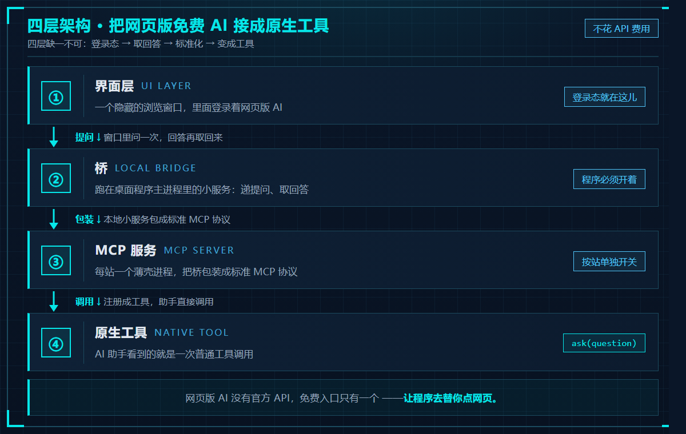

# 03 · MCP 接免费 AI

> **目标：不花 API token，把「网页版免费 AI」变成工作台里的原生工具。**
> 你本来就在浏览器里免费用它们 —— 这个板块讲怎么让本地的 AI 助手**直接调用**它们。

> ⚠️ **新手谨慎（本仓库里最需要调试的一块）**：它靠"替你点网页版 AI"工作 —— 登录态、页面结构、窗口归属任一变化就失灵，**每接一个新站都要现场调**，而且对方改版后会再坏。**别把它当成第一个上手的模块**。先读 [新手必读](../新手必读.md)。



> 上图这一板块的四层：**界面层**（登录态在哪）→ **桥**（本地小服务：递提问、取回答）→ **MCP 服务**（每站一个薄壳，包装成标准协议）→ **原生工具**（助手看到的就是一次普通工具调用）。

---

## 这个板块放什么

| 文件（待补） | 内容 |
|---|---|
| `整体架构.md` | 一张图讲清：界面 → 本地桥 → MCP 服务 → 原生工具 |
| `怎么加一个站.md` | 加一个新站点要改哪几处（内核只有一份，加站很便宜） |
| `配置片段.md` | 引擎配置里怎么写这几行 |
| `用法与产物.md` | 工具怎么调、回答落在哪、怎么接回上下文 |
| `排障.md` | 「回包来自旧桥」这类现场怎么处理 |

---

## 架构（四层，缺一不可）

```
  ① 界面层    一个隐藏的浏览窗口，里面登录着网页版 AI（登录态就在这儿）
        ↓
  ② 桥        跑在桌面程序主进程里的本地小服务，负责把"提问"递给网页、把"回答"取回来
        ↓
  ③ MCP 服务  每站一个薄壳进程，把桥包装成标准 MCP 协议
        ↓
  ④ 原生工具  AI 助手看到的就是一个普通工具调用（例如 ask(question)）
```

**为什么要这么绕**：网页版 AI 没有官方 API（或者要钱），唯一的免费入口就是"浏览器里的那个页面"。
所以思路是 —— **让程序去替你点网页**，再把结果接回本地助手。

---

## 三个设计决定（值得抄）

1. **每站一个独立 MCP，而不是一个带 `site` 参数的大 MCP**。理由：
   - 可以按站**单独开关**（不用的站不占上下文）；
   - 工具名自带站点，模型不用记"哪个 key 对应哪个站"；
   - 每个工具的描述只写自己擅长的活，指路最短。

2. **内核只有一份，每个站只是一个几行的薄壳**。加一个新站非常便宜。

3. **回答正文自动落盘，工具只回「路径 + 开头一段」**。
   长回答不进上下文，需要细节时再去读文件 —— 这是省 token 的关键一招。

---

## 两个前提（否则一定失败）

- **桌面程序必须开着** —— 桥在它的主进程里，登录态在它的浏览窗口里；
- **桥的版本必须是当前的** —— 历史包袱会导致"旧窗口抢单"，
  典型症状是回包内容对不上（跑到别的站的回答）。这类问题**重启一次程序**即可，改代码修不了。

---

⬅️ 回 [总目录](../README.md) ｜ 上一板块 ⬅️ [02-会话定位与跟随](../02-会话定位与跟随/) ｜ 下一板块 ➡️ [04-工作台搭建](../04-工作台搭建/)
