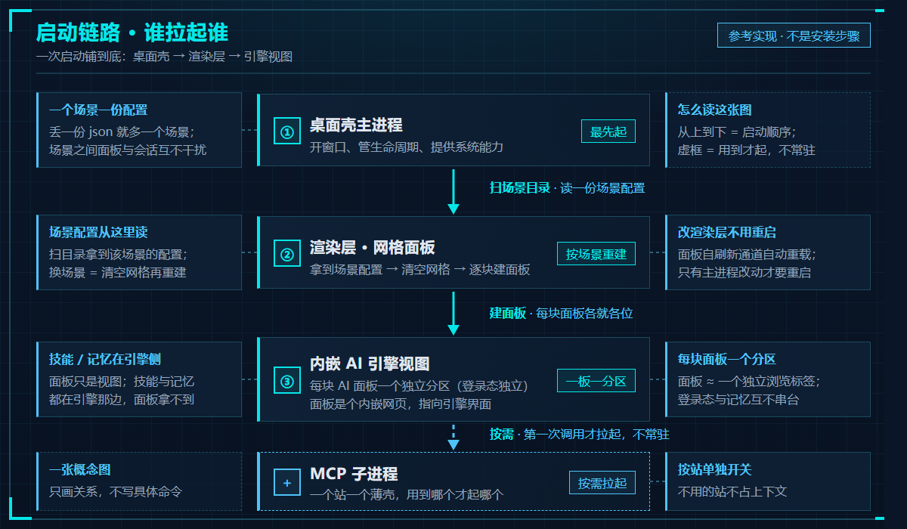

# 04 · 工作台搭建

> **总装车间。** 前三个板块是零件，这个板块讲怎么把它们装成一台能跑的机器 ——
> 以及装的过程中最容易踩的坑。

> ⚠️ **新手谨慎**：本板块给的是**参考实现**，不是安装步骤 —— 目录约定、脚本名、自检项都随你的工程而变；照抄路径一定失败。先读 [新手必读](../新手必读.md)。

> 一次启动铺到底：**桌面壳主进程**（最先起）→ **渲染层 · 网格面板**（按场景重建）→ **内嵌 AI 引擎视图**（每块面板一个独立分区）→ **MCP 子进程**（按需才拉，不常驻）。
> 虚框 = 用到才起；右列的"改哪里要重启 / 不用重启"就是 §「能自动生效的改动，不要让用户动手」那一条的落地。

---

## 这个板块放什么

| 文件（待补） | 内容 |
|---|---|
| `从零到能跑.md` | 上手路径：先跑通什么、再接什么，每步的验收标准 |
| `技术栈与启动链路.md` | 桌面壳 + 渲染层 + AI 引擎 + MCP 子进程，谁先起、谁拉起谁 |
| `目录约定.md` | 哪里放什么（**防乱建**：脚本、模板、产物、临时文件各有各的家） |
| `自检清单.md` | 改完必跑的那几个自检，各查什么 |
| `踩坑总表.md` | 「看起来成功了其实没生效」类问题的总目录 |

---

## 一条贯穿始终的工程原则

**能自动生效的改动，不要让用户动手。**

这条听起来像体验问题，其实是**架构问题**：如果每次改完都要人点一次刷新，
那自动化就断在人这里了。所以工作台里专门做了这些通道：

- 改渲染层 → 有**面板自刷新**通道（写完指令文件，主进程轮询到就重载对应面板）；
- 改引擎侧技能/配置 → **热生效**，改完即用；
- 只有真正必须重启的改动（主进程、预加载、新插件行）才提示重启，**且要说清为什么**。

判断标准很简单：**这件事机器自己能不能做？能就别交给人。**

---

## 目录约定（防乱建）

一个多场景工作台最容易烂掉的方式，就是"哪儿方便就放哪儿"。所以要事先划好：

| 放什么 | 去哪儿 |
|---|---|
| 场景配置、定位卡 | `scenarios/` |
| 面板渲染器、样式 | `renderer/` |
| 辅助脚本（建会话/换会话/自检/备份） | `scripts/` |
| 运行期数据、备份 | `data/` |
| 第三方驱动本体 | 固定的驱动目录（**只放本体**） |
| MCP 服务本体 | 固定的 MCP 目录（**只放本体**） |
| 素材、产物、小工程 | **项目盘**，不要塞进程序目录 |
| 临时文件 | 系统临时目录 |

> ⚠️ 驱动目录 / MCP 目录**不被任何机制扫描** —— 往里丢脚本、素材、试验品，
> 结果就是"没有入口、没人会用、烂在那儿"。这条是血泪。

---

⬅️ 回 [总目录](../README.md) ｜ 上一板块 ⬅️ [03-MCP接免费AI](../03-MCP接免费AI/)
