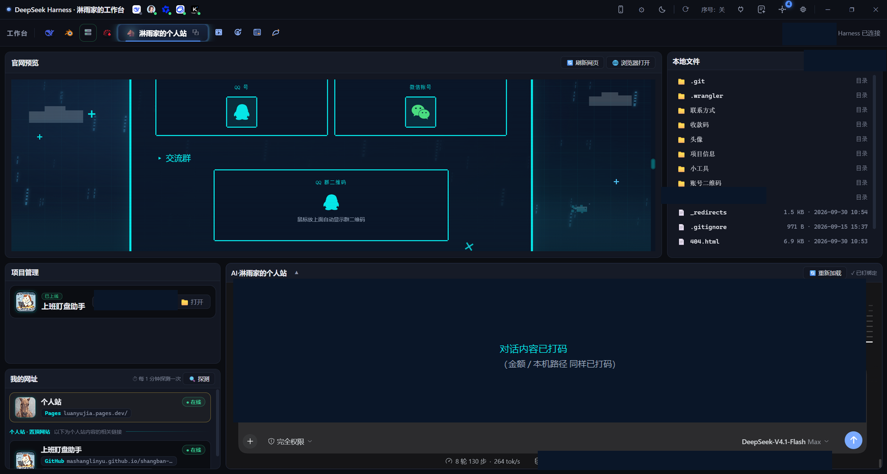

# 淋雨家的工作台

> 一套**多场景 AI 工作台**的搭建方法与纯壳模板 —— 把「一个聊天窗口」变成「一间按场景分工的工作室」。

> **作者：[淋雨家](https://luanyujia.pages.dev)**（GitHub [@mashanglinyu](https://github.com/mashanglinyu)）
> —— 仓库里的方法与模板，都来自这套工作台**边用边搭**的真实过程。


> ## ⚠️ 新手请谨慎：**这不是"装完就能用"的软件**
>
> 本仓库给的是**方法 + 纯壳模板**。场景配置、会话 id、面板类型、MCP 桥、脚本名……**都要按你自己的内容调试**，
> 文档里的路径**全是占位符，照抄一定失败**；不少模块（尤其 MCP）需要现场排查才能跑通。
>
> 👉 **动手前先读 [`新手必读.md`](新手必读.md)**：哪些能直接用、哪些必须自己改、最容易劝退的五件事。

---

## 这是什么

把本地 AI 助手包进一个**分场景的桌面工作台**：

- 每个场景 = 一块独立的界面（网格面板 + 一个常驻 AI 会话）；
- 每个场景的 AI **认得自己是哪个场景**：知道该读哪份记忆、该用什么技能、上次干到哪儿；
- 面板能直接预览网页、浏览文件、显示网址、看数据 —— 不只是聊天框。



> 上面就是一间**真跑着的**多场景工作台：顶上一排图标 = 各个场景（点它 = 切场景），中间是网格面板（预览 / 文件 / 项目 / 网址 / AI 对话）。
> **截图里的金额、本机路径与对话正文都已打码** —— 本仓库所有图片都按同一规矩处理，见 [`配图/README.md`](配图/README.md)。

本仓库只分享**方法与纯壳模板**，**不含任何个人内容、私密路径、密钥或业务数据**。

---

## 四个板块

| # | 板块 | 一句话 | 目录 |
|---|---|---|---|
| 01 | **场景模式** | 一个窗口 = 一块场景：配置格式、网格布局、面板类型 | [`01-场景模式/`](01-场景模式/) |
| 02 | **会话定位与跟随** | AI 怎么知道「我是谁」，以及「我该跟着哪个窗口走」 | [`02-会话定位与跟随/`](02-会话定位与跟随/) |
| 03 | **MCP 接免费 AI** | 把网页版免费 AI 接成本地原生工具，不花 API token | [`03-MCP接免费AI/`](03-MCP接免费AI/) |
| 04 | **工作台搭建** | 从零搭一间：技术栈、目录约定、启动链路、自检、踩坑 | [`04-工作台搭建/`](04-工作台搭建/) |

另外两个附属目录（外加一份必须先读的说明）：

- [`新手必读.md`](新手必读.md) —— ⚠️ **动手前的门槛说明**：哪些能直接用、哪些必须自己调、最容易劝退的五件事
- [`模板/`](模板/) —— 可拷贝的**纯壳**（拷完必须按你自己的环境改：路径、会话 id、面板类型…）
- [`配图/`](配图/) —— 文档用的截图

---

## 文档地图（一眼看全）

```
淋雨家的工作台/
├── 新手必读.md              ← ⚠️ 先读这个：能不能用、要改哪里、别踩什么
├── 01-场景模式/             「壳」界面怎么搭（不涉及 AI）
│   ├── 场景配置格式.md       一份 JSON 描述一个场景（字段表 + 最小示例）
│   ├── 布局与网格.md         面板摆哪儿（col/row/w/h、六种版式）
│   ├── 面板类型与注册.md      加一个自己的面板（含可拷贝代码）
│   └── 面板通用能力.md       标题栏 / 展开 / 自刷新 / 与外壳通信
├── 02-会话定位与跟随/        「魂」AI 怎么认得自己 ★ 本仓库的核心
│   ├── 一-身份是怎么认领的.md
│   ├── 二-会话绑定三字段.md   ★ 最核心的一页（pinTarget / sessionTitle / sessionId）
│   ├── 三-跟着窗口走.md
│   ├── 四-防串台.md
│   ├── 五-换会话与归档.md
│   └── 六-记忆分三层.md
├── 03-MCP接免费AI/          「手」给 AI 接外部能力（🚧 正文整理中，也最需要调试）
├── 04-工作台搭建/           「总装」从零到能跑（🚧 正文整理中）
├── 模板/                    拷走就能改的纯壳（⚠️ 拷完必须按清单改，见该目录 README）
└── 配图/                    文档配图（3 张实拍已打码 + 2 张架构图）
```

## 三种读法（你是哪种读者）

| 你是哪种人 | 怎么读 |
|---|---|
| **只是好奇**这是什么 | 上面「这是什么」→ [新手必读](新手必读.md) §1 那张「哪些能直接用 / 哪些必须自己调」的表 |
| **想搭一个自己的** | [新手必读](新手必读.md) §4 的六步（每步有验收标准）→ [01](01-场景模式/) → [02](02-会话定位与跟随/) → [04](04-工作台搭建/) |
| **已经搭着、卡在某个症状上** | 直接翻各篇末尾的**「症状对照」**表：[01 配置格式](01-场景模式/场景配置格式.md)、[02 绑定三字段](02-会话定位与跟随/二-会话绑定三字段.md)、[03 排障](03-MCP接免费AI/)（🚧 正文待补） |

---

## 为什么这么分（划分逻辑）

四块对应四件**可以独立看懂、独立替换**的事：

| 板块 | 是什么 | 换个说法 |
|---|---|---|
| 01 场景模式 | **壳** | 纯 UI 与配置，不涉及 AI。想换界面只动这里 |
| 02 会话定位与跟随 | **魂** | 工作台和「多标签浏览器」的根本区别就在这：AI 有身份、有记忆、认窗口 |
| 03 MCP 接免费 AI | **手** | 给 AI 接外部能力，而且不花 API 钱 |
| 04 工作台搭建 | **总装** | 把前三个装成一台能跑的机器 |

顺序上也是**依赖顺序**：先有 01 的壳，才谈得上 02 绑会话；01 + 02 跑通之后再接 03；04 是把三者合起来的上手路径。

---

## 建议的上手顺序

0. **先读 [`新手必读.md`](新手必读.md)** —— 它不是客套话：这个仓库里"抄了不能用"的地方都列在那一页；
1. 读 [`04-工作台搭建/`](04-工作台搭建/) 的「从零到能跑」—— 先建立全局印象（🚧 正文还没写，可先看该目录 README 里的要点）；
2. 照 [`01-场景模式/`](01-场景模式/) 定义你自己的第一个场景（先用占位面板，不接 AI）；
3. 照 [`02-会话定位与跟随/`](02-会话定位与跟随/) 把 AI 绑上去，让「切场景 = 切脑子」成立（**会话 id 必须是你的**）；
4. 需要省 token 时再看 [`03-MCP接免费AI/`](03-MCP接免费AI/)，把网页版 AI 接成工具 —— **这块最需要现场调试，别第一个上**。

> 每一步都有验收标准，写在 [`新手必读.md`](新手必读.md) §4：**看得见的落点才算过**（面板在位 / 画面切对 / 工具返回真实回答）。

---

## 状态

🚧 **正文陆续发布中** —— 目前已完成：

- ✅ [01 · 场景模式](01-场景模式/) —— 四篇全齐（配置格式 / 布局与网格 / 面板类型与注册 / 面板通用能力）
- ✅ [02 · 会话定位与跟随](02-会话定位与跟随/) —— 六篇全齐（**核心是[会话绑定三字段](02-会话定位与跟随/二-会话绑定三字段.md)**）
- ✅ [模板](模板/) —— 两个纯壳场景 + 一个面板渲染器 + 两份记忆模板
- ✅ [配图](配图/) —— **5 张齐了**：3 张实拍（按坐标打码：金额 / 本机路径 / 对话正文 / 用量统计）+ 2 张架构图（四层架构 / 启动链路）
- 🚧 [03 · MCP 接免费 AI](03-MCP接免费AI/)、[04 · 工作台搭建](04-工作台搭建/) —— 目录与要点已就位，正文整理中

> 已完成的部分都经过一次**公开内容体检**（盘符路径 / 真实会话 id / 内部实现名 / 第三方名 / 密钥，全仓扫描）与**链接有效性检查**。

想第一时间拿到更新：**Watch → Custom → Releases**，或先 **Star** 收藏。

---

## 作者

**淋雨家** —— 一个人在用、边踩坑边写下来的工作台。

| | |
|---|---|
| 个人站 | <https://luanyujia.pages.dev> |
| GitHub | [@mashanglinyu](https://github.com/mashanglinyu) |
| 同作者的另一套东西 | 个人站首页「小工具」区（含本仓库的入口卡片） |

这套工作台不是设计出来的，是**用出来的**：仓库里每条结论背后都对应一次真实事故
（所以各板块都带「症状对照」——那是踩坑记录，不是免责声明）。
有问题欢迎开 Issue；也欢迎直接到个人站找我。

---

## 许可

**MIT** —— 随内容一起提交 `LICENSE`。

---

<p align="center">
  <sub>作者 <b>淋雨家</b> · 个人站 → <a href="https://luanyujia.pages.dev">luanyujia.pages.dev</a> · GitHub → <a href="https://github.com/mashanglinyu">@mashanglinyu</a></sub>
</p>
